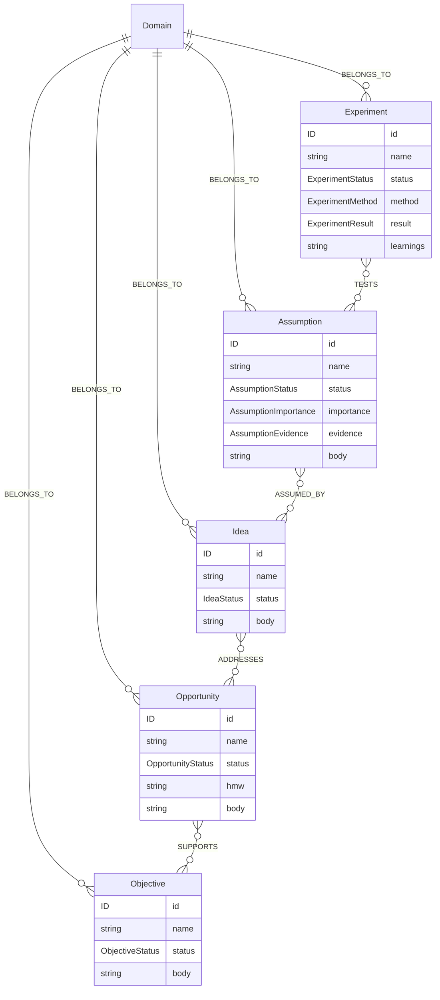
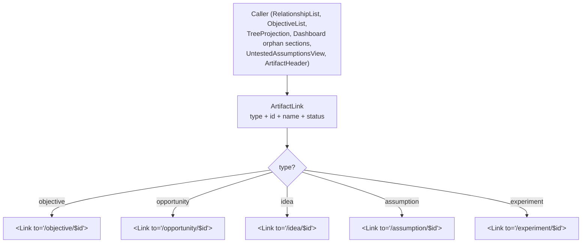
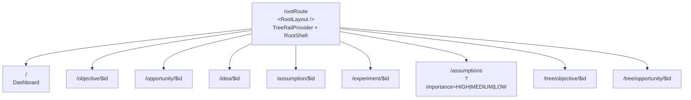
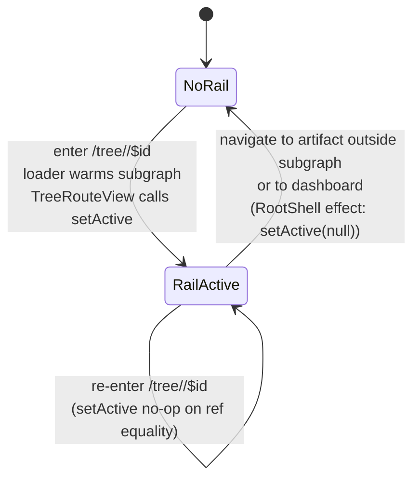
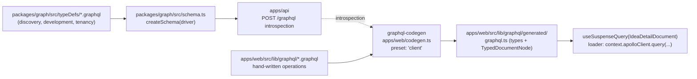

# M1 Discovery Explorer — Technical Walkthrough

This document is a top-down tour of what the M1 milestone of the Etak Discovery
Explorer built. It is aimed at a technically literate contributor who wants to
understand how the system fits together well enough to navigate, extend, or
debug it — not a marketing overview and not a getting-started guide. For local
setup, see [`apps/web/README.md`](../../../apps/web/README.md).

The walkthrough starts at the system boundary and drills down into the code.
Every significant component, query, and primitive is linked to its file so the
doc doubles as a navigation map.

## Executive summary

M1 delivers a read-only web client for exploring the discovery space of a
single domain stored in a Neo4j-backed GraphQL API. The goal is to prove that
a graph-backed artifact store produces a qualitatively different experience
from flat artifact lists: every artifact has its own canonical URL, typed
relationships are hyperlinks, and an optional tree-projection rail makes
hierarchy legible without claiming the graph *is* a hierarchy.

The running experience: you open `/`, see a dashboard with a health ribbon,
objectives, and orphan sections. You click an objective, land on its artifact
page, follow a "Supports" link sideways to an opportunity, then to an idea, an
assumption, and the experiment that tested it. Each step is a client-side
navigation backed by Apollo Client's normalized cache. If you instead open
`/tree/objective/:id`, the same content loads into a persistent left rail;
clicking a node navigates laterally while the rail stays put. At `/assumptions`
you see untested high-importance claims with their parent-idea context, each
row a link into both the assumption and its idea.

Write flows, the spatial canvas, multi-domain switching, and production auth
are all explicitly deferred. The foundation is designed to let those land
later without restructuring.

## System architecture

Three processes and a database:

```mermaid
flowchart LR
  subgraph Browser[Browser]
    React[React 19 + TanStack Router]
    Apollo[Apollo Client<br/>InMemoryCache]
  end

  subgraph Node[Node.js process - apps/api]
    Express[Express + CORS]
    ApolloServer[Apollo Server 4]
    Neo4jGraphQL[&#64;neo4j/graphql]
    Auth[resolveDomainFromApiKey]
  end

  Neo4j[(Neo4j 5<br/>single database<br/>multi-tenant by Domain node)]

  React --> Apollo
  Apollo -- "POST /graphql<br/>x-api-key header" --> Express
  Express --> Auth
  Express --> ApolloServer
  ApolloServer --> Neo4jGraphQL
  Neo4jGraphQL -- "Bolt (neo4j-driver)" --> Neo4j
  Auth -- "hashApiKey + MATCH Domain" --> Neo4j
```



- [`apps/api/src/server.ts`](../../../apps/api/src/server.ts) wires Express,
  Apollo Server, and the `@neo4j/graphql` schema together, and installs the
  per-request domain-resolution context.
- [`apps/api/src/auth.ts`](../../../apps/api/src/auth.ts) SHA-256-hashes the
  incoming API key and looks up the Domain node. The plaintext key is never
  stored or logged.
- [`packages/graph/src/schema.ts`](../../../packages/graph/src/schema.ts)
  builds the executable GraphQL schema from the SDL files in
  [`packages/graph/src/typeDefs/`](../../../packages/graph/src/typeDefs).
- [`apps/web/src/main.tsx`](../../../apps/web/src/main.tsx) mounts React with
  `ApolloProvider` at the root, so every route and component has access to
  the same client instance.
- [`apps/web/src/lib/apollo.ts`](../../../apps/web/src/lib/apollo.ts) creates
  the Apollo client with a static `x-api-key` header read from
  `VITE_API_KEY`. Because `VITE_*` variables are inlined into the bundle at
  build time, this key is public — a real auth story is explicitly out of
  scope (see "What M1 defers" below).

The tenancy model is "single database, multi-tenant via a `Domain` node". Every
artifact has a `BELONGS_TO` relationship pointing at exactly one `Domain`, and
every read query is scoped through that edge. The client never selects a
domain — the API key resolves to one, and
[`apps/web/src/lib/domain.ts`](../../../apps/web/src/lib/domain.ts) reads the
matching slug from `VITE_DOMAIN_SLUG` for queries that take it as an explicit
argument.

## The graph data model

The discovery space is five artifact types connected by five named edges.
Everything lives in one Neo4j database; the `Domain` node is the tenancy
boundary. The SDL source of truth is
[`packages/graph/src/typeDefs/discovery.graphql`](../../../packages/graph/src/typeDefs/discovery.graphql).



Edges are directional in Neo4j but exposed symmetrically in GraphQL: the
Objective type has `supportedBy: [Opportunity!]!` via `SUPPORTS` (incoming),
and the Opportunity has `supports: [Objective!]!` on the same edge (outgoing).
The same pattern holds for `ADDRESSES`, `ASSUMED_BY`, and `TESTS`.

The tree projection (Objective → Opportunity → Idea → Assumption → Experiment)
is *one projection* of this graph, not the graph itself. Nothing in the model
forces an artifact to have a parent at any level, and that absence is a
first-class signal — see the "orphans as a feature" section of the
[discovery-explorer spec](../specs/web-ui-discovery-explorer.md).

## Data flow: rendering the dashboard

The dashboard is the most instructive data-flow example because it combines
route-level loader pre-warming, multiple parallel queries, and
`useSuspenseQuery` for near-instant component render.

```mermaid
sequenceDiagram
  participant U as User
  participant R as TanStack Router
  participant L as "/" loader
  participant A as Apollo Client
  participant API as apps/api (Apollo Server)
  participant N as &#64;neo4j/graphql + Neo4j
  participant D as &lt;Dashboard /&gt;

  U->>R: navigate /
  R->>L: run indexRoute.loader
  par warm cache in parallel
    L->>A: query DiscoveryHealth
    L->>A: query ObjectivesWithOpportunities
    L->>A: query OrphanedOpportunities
    L->>A: query UnrootedIdeas
    L->>A: query UnrootedAssumptions
  end
  A->>API: POST /graphql (x-api-key)
  API->>API: resolveDomainFromApiKey
  API->>N: executeCypher (5 &#64;cypher traversals)
  N-->>API: rows
  API-->>A: GraphQL responses
  A-->>L: promises resolve
  L-->>R: loader done
  R->>D: mount component
  D->>A: useSuspenseQuery (5x)
  A-->>D: cached results (synchronous)
  D-->>U: rendered dashboard
```

Two things worth noticing:

1. **Parallelism comes from the loader**, not from the component. The loader
   in [`apps/web/src/router.tsx`](../../../apps/web/src/router.tsx) fires all
   five queries via `Promise.all` before the component mounts, so
   `useSuspenseQuery` resolves synchronously from the normalized cache when
   `<Dashboard>` renders. Compare this to the alternative where the component
   kicks off fetches on mount — each `useSuspenseQuery` call would suspend,
   unsuspend, then the next would suspend, producing a waterfall.
2. **The cache is the contract between loader and component.** The loader
   doesn't return data to the component; it returns `null`, having side-effected
   Apollo's cache. The component then reads the same documents with the same
   variables and gets hits. This means tests that want to exercise the
   component without the loader can seed the cache directly — see
   [`apps/web/src/components/artifact/cache.test.tsx`](../../../apps/web/src/components/artifact/cache.test.tsx).

The Dashboard component itself is at
[`apps/web/src/components/dashboard/Dashboard.tsx`](../../../apps/web/src/components/dashboard/Dashboard.tsx),
with presentational children
[`HealthBar.tsx`](../../../apps/web/src/components/dashboard/HealthBar.tsx),
[`ObjectiveList.tsx`](../../../apps/web/src/components/dashboard/ObjectiveList.tsx),
and [`OrphanSection.tsx`](../../../apps/web/src/components/dashboard/OrphanSection.tsx).

## Hypertext navigation

The information architecture is built on two complementary projections of one
graph: **hypertext** (the primary read model) and **the tree** (an optional
orientation device, covered below).

No breadcrumbs. The graph is genuinely non-hierarchical — an idea can be
addressed by multiple opportunities, and many artifacts have no parent at all.
A breadcrumb trail would imply a canonical parent path that does not exist.
Upward context lives in the `RelationshipList` sections ("Supports",
"Addresses", "Assumed by") on the artifact page itself, and in the tree rail
when one is active.

Every navigation between artifacts flows through a single primitive:
[`ArtifactLink`](../../../apps/web/src/components/artifact/ArtifactLink.tsx).
It renders a type icon + name + status badge, and dispatches through a typed
`switch` on artifact type to the matching `<Link to="/idea/$id">` etc. The
switch exists so TanStack Router's compile-time checks cover every link —
there is no runtime-constructed path string and no `as any` cast.



The lateral navigation surface is the `RelationshipList`:
[`apps/web/src/components/artifact/RelationshipList.tsx`](../../../apps/web/src/components/artifact/RelationshipList.tsx).
It groups relationships by section label, and each section's items are
`ArtifactLinkProps` passed straight to `ArtifactLink`. The per-type wrapper
(e.g. [`IdeaArtifactPage`](../../../apps/web/src/components/artifact/IdeaArtifactPage.tsx))
decides which sections appear and in what order — that's the only per-type
logic in the artifact-page system. The page shell itself,
[`ArtifactPage.tsx`](../../../apps/web/src/components/artifact/ArtifactPage.tsx),
is type-agnostic.

## Routes and the AppShell

The route tree is flat by design. Every artifact type is a sibling, the tree
routes are their own pair, the dashboard is the index, and `/assumptions` is
the one filtered list view. The full tree lives in
[`apps/web/src/router.tsx`](../../../apps/web/src/router.tsx).



The AppShell is three regions:

```
+----------+---------------+-------------------------+
| Sidebar  | Tree rail     | Main content            |
| (fixed)  | (optional)    | (artifact / dashboard)  |
+----------+---------------+-------------------------+
```

Source: [`apps/web/src/components/layout/AppShell.tsx`](../../../apps/web/src/components/layout/AppShell.tsx),
[`Sidebar.tsx`](../../../apps/web/src/components/layout/Sidebar.tsx). The
sidebar is always visible. The tree rail appears conditionally; the policy
for when it appears is in `<RootShell />` inside `router.tsx` and is worth
reading carefully.

**The rail-persistence policy.** The rail shows up when either:

- the user is currently on a `/tree/...` route, or
- the user is on an artifact page *whose id is part of the currently loaded
  subgraph*.

This is what preserves tree orientation across lateral navigation: you open
`/tree/objective/X`, the objective's subgraph is loaded and cached, you click
an idea node inside it, you land on `/idea/Y`, and the rail stays visible
because `Y` is in the loaded subgraph. If instead you navigate to an
unrelated idea via the sidebar or a direct URL, the rail collapses.

The routing layer, the context, and the rail visibility policy are three
separate pieces that need to stay in sync:



## The tree projection

The tree projection is loaded by two routes — `/tree/objective/$id` and
`/tree/opportunity/$id` — and rendered in the rail by
[`TreeRail.tsx`](../../../apps/web/src/components/tree/TreeRail.tsx) /
[`TreeProjection.tsx`](../../../apps/web/src/components/tree/TreeProjection.tsx).
The per-route view components live in
[`TreeRouteViews.tsx`](../../../apps/web/src/components/tree/TreeRouteViews.tsx).

The type-agnostic tree model is in
[`apps/web/src/lib/treeProjection.ts`](../../../apps/web/src/lib/treeProjection.ts).
Two projector functions (`projectObjectiveSubgraph`,
`projectOpportunitySubgraph`) flatten the two GraphQL response shapes into a
single recursive `TreeNode` type with a discriminating `type` field and a
uniform `children` array. The renderer walks one shape; it knows nothing
about which root type it came from.

Helpers in the same file:

- `ancestorPath(root, targetId)` — used to compute the default expansion:
  only the selected node's path is expanded on first render.
- `visibleNodes(root, expanded)` — flat, in-order list of currently-visible
  nodes, used by the keyboard handler to compute previous/next focus.
- `allNodes(root)` — every node regardless of expansion, used by `<RootShell />`
  to decide whether the current route's id is inside the loaded subgraph.
- `isUntestedHighImportance(node)` — the single most important discovery-health
  signal, surfaced as a warning glyph in the tree.

Rail state is React context, not a module-level singleton:
[`apps/web/src/lib/treeRailContext.tsx`](../../../apps/web/src/lib/treeRailContext.tsx).
The provider holds an `ActiveTreeProjection | null` slot, and the tree-route
views install a projection via `setActive` in a `useLayoutEffect` — not a
regular `useEffect`, so the rail commits in the same paint as the tree-route
content and there is no one-frame flash on first navigation. See the comment
in `ObjectiveTreeView` for the full reasoning.

The "Unrooted at this level" disclosure at the bottom of the rail is fed by a
separate orphan query: `orphanedOpportunities` at the objective level,
`unrootedIdeas` at the opportunity level. Both are cache-warmed by the same
route loader that fetches the subgraph, so the rail renders them without a
second round-trip.

## GraphQL codegen pipeline

The client writes queries as plain `.graphql` files in
[`apps/web/src/lib/graphql/`](../../../apps/web/src/lib/graphql). A codegen
step reads the live schema from the running API and produces typed document
nodes into
[`apps/web/src/lib/graphql/generated/`](../../../apps/web/src/lib/graphql/generated).
Generated files are committed so a fresh checkout builds without a running
API server.



Config: [`apps/web/codegen.ts`](../../../apps/web/codegen.ts). It uses the
`client` preset with `documentMode: 'documentNode'` so each operation is
exported as a `TypedDocumentNode` whose `TVariables` / `TData` flow through
every consumer — `useSuspenseQuery`, `client.query` in a route loader, and
any Apollo cache reads.

The practical consequence: adding a new query is a three-step edit. Write the
`.graphql` file, run `npm run codegen --workspace=apps/web`, import the
generated document from
[`generated/graphql.ts`](../../../apps/web/src/lib/graphql/generated/graphql.ts).
Schema changes in `packages/graph` propagate the same way — the codegen is
the seam between the two packages.

## Schema design notes

Three facets of the schema are load-bearing for how the client works.

**Multi-tenant scoping via `@cypher`.** `@neo4j/graphql` generates
Cypher-backed resolvers for the `@node` types, but traversal queries —
`opportunitySubgraph`, `objectiveSubgraph`, `untestedAssumptions`, all three
orphan queries, and `discoveryHealth` — are hand-written `@cypher` directives
in
[`discovery.graphql`](../../../packages/graph/src/typeDefs/discovery.graphql).
Every nested level in these traversals is *re-scoped to the queried domain*
via an `OPTIONAL MATCH ... -[:BELONGS_TO]-> (d:Domain {slug: $domainSlug})`
constraint. This makes cross-domain edges invisible on read: an Assumption in
domain A whose only `ASSUMED_BY` edge points at an Idea in domain B appears
as unrooted from A's perspective, not as a relationship to a foreign node.
The comments on each `@cypher` statement are worth reading — they spell out
exactly what "cross-domain edges are invisible" means in each case.

**The `untestedAssumptions` rewrite.** The current query returns a custom
`UntestedAssumptionWithContext` projection that includes a single
deterministic parent idea per assumption. The reason for the custom return
type (rather than a straight `[Assumption!]!`) is that `@cypher` return types
do not automatically resolve `@relationship` fields, so a nested `assumedBy`
traversal cannot be attached after the fact. The parent idea has to be
projected in Cypher and returned in the same shape. The "first parent" rule
(earliest `createdAt`, tie-broken by `id`) keeps the result stable when an
assumption is linked to multiple in-domain ideas.

**Orphans as a feature.** `orphanedOpportunities`, `unrootedIdeas`, and
`unrootedAssumptions` are not error states or QA shortcuts. Disconnected
artifacts are a genuine and informative feature of discovery work — teams
capture stray ideas, surface assumptions in conversation, and only later
connect them to business value. The queries exist so the dashboard can
surface them as first-class navigable sections, and so the tree rail can
show "Unrooted at this level" disclosures without a second round-trip. See
the ["orphans as a feature"](../specs/web-ui-discovery-explorer.md#orphans-as-a-feature)
section of the spec for the rationale.

## A complete user journey

To tie everything together, here is a single journey traced through the
layers.

```mermaid
sequenceDiagram
  participant U as User
  participant R as Router (TanStack)
  participant Shell as RootShell
  participant Ctx as TreeRailContext
  participant A as Apollo Client
  participant API as apps/api
  participant Dash as Dashboard
  participant Obj as ObjectiveArtifactPage
  participant TV as ObjectiveTreeView
  participant Rail as TreeRail

  U->>R: open /
  R->>A: indexRoute.loader warms 5 queries
  A->>API: parallel POSTs
  API-->>A: responses
  R->>Dash: mount
  Dash->>A: useSuspenseQuery x5 (cache hit)
  Dash-->>U: render health bar + objectives + orphans

  U->>R: click /tree/objective/O1
  R->>A: loader warms ObjectiveSubgraph + OrphanedOpportunities + ObjectiveDetail
  R->>TV: mount
  TV->>A: useSuspenseQuery(ObjectiveSubgraph) (cache hit)
  TV->>Ctx: setActive({ rootType, root, unrooted }) in useLayoutEffect
  Shell-->>Rail: render rail (onTreeRoute === true)
  TV->>Obj: render &lt;ObjectiveArtifactPage id="O1" /&gt;
  Obj-->>U: header + body + RelationshipList

  U->>R: click ArtifactLink for Idea I7 (inside rail)
  R->>A: ideaRoute.loader warms IdeaDetail
  R->>Obj: unmount
  R->>Shell: pathname changes to /idea/I7
  Shell->>Shell: effect: I7 in allNodes(active.root)? yes → keep rail
  Shell-->>Rail: rail stays, selectedId = I7
  R->>Obj: mount IdeaArtifactPage
  Obj-->>U: new artifact page, rail unchanged

  U->>R: click /assumptions from sidebar
  R->>A: assumptionsRoute.loader warms UntestedAssumptions
  R->>Shell: pathname changes to /assumptions
  Shell->>Shell: effect: selectedId not in active.root → setActive(null)
  Shell-->>Rail: rail unmounts
  R->>Dash: mount UntestedAssumptionsView
```

Five observable behaviors worth calling out:

1. Loaders run before components mount, so `useSuspenseQuery` is nearly always
   a cache hit and the Suspense fallback is rarely seen.
2. The rail commits in the same paint as the tree route, not one frame late.
3. Clicking a rail node causes a route change, not a re-fetch of the subgraph
   — the cache already has the detail query for the destination (warmed by
   the artifact route's own loader) and the subgraph data is unchanged.
4. Navigating out of the subgraph garbage-collects the loaded tree via
   `setActive(null)`, so a long session browsing unrelated routes doesn't pin
   a large subgraph in React state.
5. The `/assumptions` route uses URL search params as the source of truth for
   the importance filter — `importance=HIGH|MEDIUM|LOW` or omitted entirely.
   The loader keys the cache on the validated filter, so changing filters is
   a re-run of the loader with new variables, not a client-side filter over
   an already-loaded list. The narrow from arbitrary input to the three valid
   values is centralized in one helper in
   [`router.tsx`](../../../apps/web/src/router.tsx) so `validateSearch`,
   `loaderDeps`, and the route component can't drift.

## What M1 explicitly defers

- **Writing from the UI.** No mutations, no editing, no creation flows.
  Editing is a mixed-initiative collaborative concern with different
  interactions per artifact type and is intentionally out of scope for M1.
- **Spatial canvas / force-directed graph.** The long-term direction, but not
  this milestone. M1 uses two projections (hypertext + tree); the canvas is
  the third projection, future work.
- **Multi-domain switching in the client.** The API key resolves to one
  domain, and that is the whole story for M1. If this ever becomes a feature,
  it is a multi-key management layer in the client, not a server change.
- **Production auth.** `VITE_API_KEY` is inlined into the bundle at build
  time and is therefore public. M1 ships with `seed-dev-key` for local dev
  only. A real auth story is a separate future project.
- **Production hardening.** No CSP, no telemetry, no hosting story.

## Where to go next

- The master spec: [`docs/development/specs/web-ui-discovery-explorer.md`](../specs/web-ui-discovery-explorer.md).
- The milestone: [`docs/development/milestones/m1-web-discovery-explorer.md`](../milestones/m1-web-discovery-explorer.md).
- Individual stories under [`docs/development/stories/`](../stories/) — each
  M1 story corresponds to one merged PR.
- Running it: [`apps/web/README.md`](../../../apps/web/README.md).
- Future auth: the production-user-authentication project under
  [`docs/development/projects/`](../projects/).
